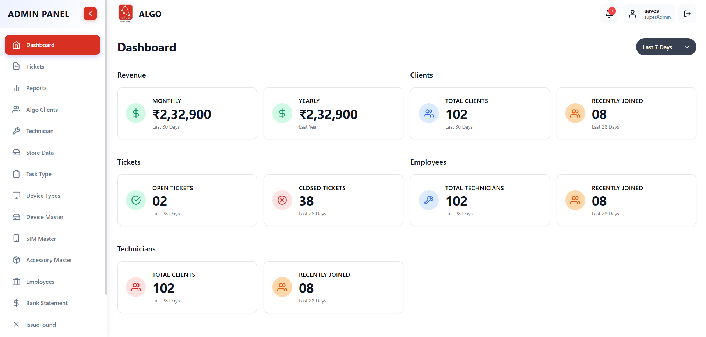
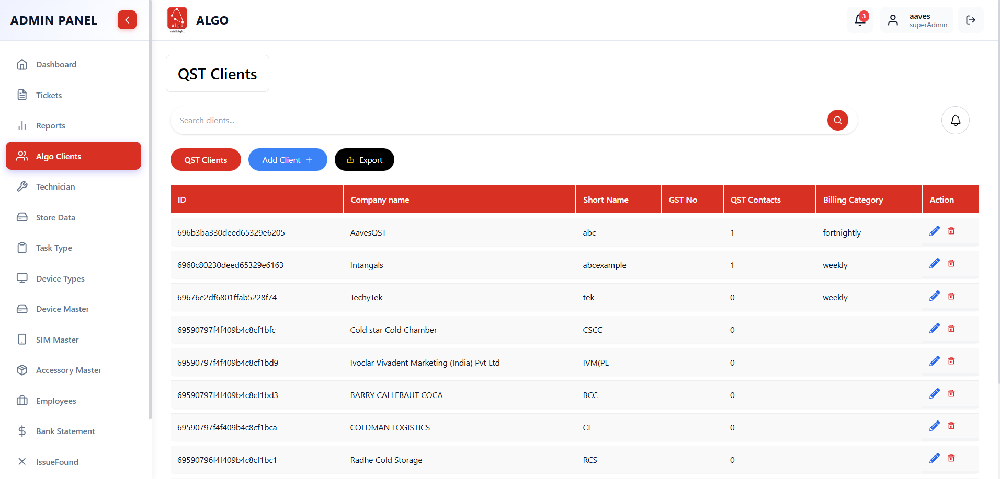
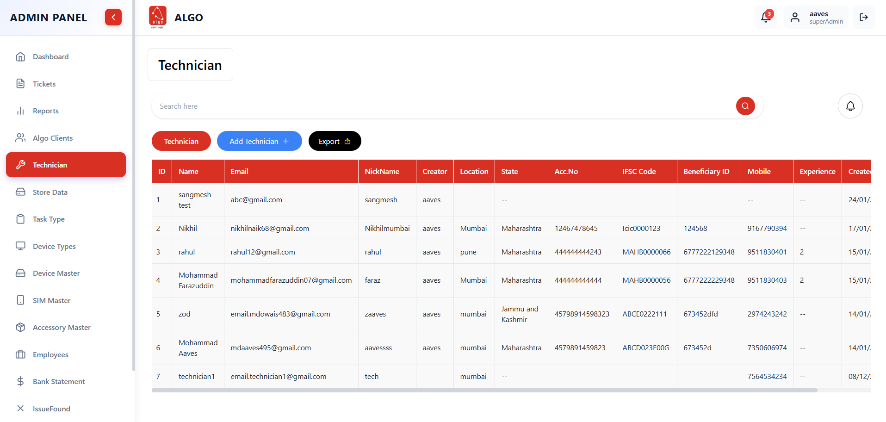
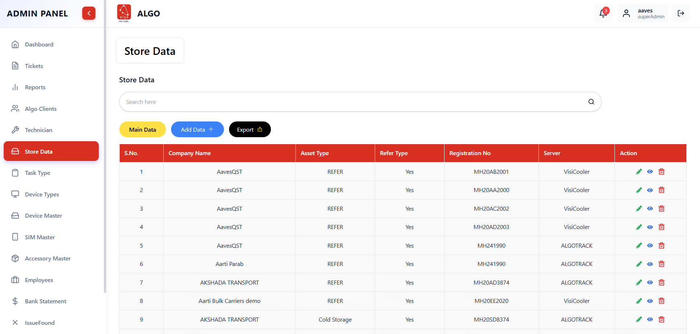

# 🧠 AlgoMatix CRM

AlgoMatix is a full-stack CRM and operations management platform designed to streamline business workflows, automate routine tasks, and improve team productivity through intelligent backend systems and real-time dashboards.

The platform helps organizations manage leads, follow-ups, document expiry, operational tasks, and reporting in a single unified system.
It is built with a strong focus on automation, scalability, and backend reliability, making it suitable for teams handling large volumes of operational data.

On the Admin side, AlgoMatix provides a centralized dashboard to manage leads, track task statuses, monitor team performance, and configure automation rules.
On the Server side, background services and schedulers handle document expiry tracking, automated notifications, follow-ups, and periodic reporting with minimal manual intervention.

Overall, AlgoMatix acts as a smart operations layer between business teams and data, reducing human effort and ensuring nothing falls through the cracks.

---

## 🚀 Core Features
CRM & Operations

Lead Management – Create, update, and track leads across their entire lifecycle.

Task Tracking – Assign tasks, monitor statuses, and manage follow-ups.

Status Pipelines – Custom workflows for lead progress and operational states.

Audit Logs – Track important actions and changes for accountability.

Automation & Background Jobs

Cron-based Automation – Scheduled reminders, follow-ups, and expiry checks.

Document Expiry Tracking – Automatically monitors critical documents and flags expiring items.

Automated Notifications – System-generated alerts for missed actions and deadlines.

Periodic Reports – Daily/weekly system reports generated automatically.

Data & Performance

Server-side Pagination – Handles large datasets efficiently.

Search & Filtering – Fast querying for leads and operational records.

Bulk Data Processing – Supports large data uploads and exports.

High-performance APIs – Optimized REST APIs for real-time usage.

## 👨‍💻 My Roles & Responsibilities

In AlgoMatix, I worked primarily on backend systems, automation logic, and scalable APIs:

Designed and developed core backend architecture using Node.js, Express, and MongoDB.

Implemented cron-based background jobs for automated reminders, follow-ups, expiry checks, and scheduled reporting.

Built RESTful APIs for lead lifecycle management, task pipelines, and status transitions.

Developed document expiry tracking system with automated alerts and notifications.

Designed MongoDB schemas and indexes for handling large operational datasets efficiently.

Implemented server-side pagination, search, and filtering for high-performance data handling.

Built bulk data processing modules for imports, validation, and exports.

Added audit logging and activity tracking for operational transparency.

Ensured secure API access with middleware-based validation and role handling.

Followed modular architecture and clean code practices for scalability and maintainability.

## 🛠️ Tech Stack

Frontend: React.js, Tailwind CSS

Backend: Node.js, Express.js

Database: MongoDB

Infrastructure: Nginx

Automation: Node schedulers / Cron jobs

Other Tools: REST APIs, Git/GitHub, Postman

## ⚡ Key Engineering Highlights

Built a fully automated operations pipeline using background jobs.

Reduced manual tracking by introducing expiry-based automation logic.

Designed APIs capable of handling 19,000+ records with low latency.

Implemented real-world CRM workflows, not just CRUD operations.

Focused on backend reliability, performance, and scalability.

---

## ⚡ Setup & Installation

1. ©️ Clone the repo:
   
   ```bash
   git clone https://github.com/yourusername/quick-mobile.git
   cd quick-mobile

2. 🔽 Install Dependencies:

    ```bash
    npm install

3. 🔰 Start the  development server:
   
   ```bash
   npm run dev

---

## ⚠️ Disclaimer  
This project is a **conceptual/demo implementation**.  
The **source code is not real** and is intended **only for presentation purposes**, not for production or official use.  

---

## 📸 Screenshots 


<p align="center">
  
</p>


<p align="center">
  
</p>


<p align="center">
  
</p>


<p align="center">
  
</p>


<p align="center">
  
</p>


<p align="center">
  
</p>


---

## 📌 Use Case

AlgoMatix is ideal for:

Operations teams

Sales & lead management teams

Support teams handling follow-ups

Businesses managing expiring documents

Any workflow requiring automation + tracking + reporting

## ⚠️ Disclaimer

This project represents a real-world inspired CRM system built for learning and demonstration.
Sensitive business logic and credentials are not included.
The repository showcases system design, backend engineering, and automation workflows for portfolio purposes.

## 🧩 Why AlgoMatix is a Strong Project

Unlike generic CRUD apps, AlgoMatix demonstrates:

Real business automation

Real backend systems

Real operational workflows

Real scalability problems

Real engineering thinking
